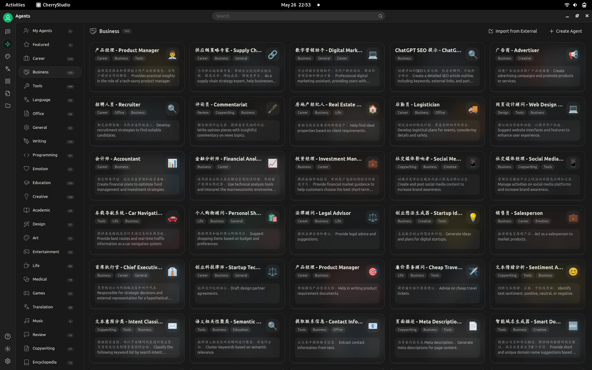

# llm desktop apps

While browsing through [MCP clients
list](https://github.com/punkpeye/awesome-mcp-clients) I discovered a few apps,
like Cherry Studio, AnythingLLM and a few more. Some clients run in the
browser, like librechat (which needs mongo), some are more packaged desktop
apps. One demo showed anythingLLM in combination of LM studio. LM studio does
have an own storage folder, cannot out of the box use ollama storage,
seemingly.

Lots of prepared prompts and agents.

Categories are somewhat clear, but applications boundaries are still floating:

* LLM model abstraction, API, cloud, local
* MCP list with misc tools, resources, prompts template
* some app that connects these things, browser, desktop

Could see how companies, org deploy a configured desktop app with custom MCP
for their domain as a universal utility; plus search and MCP for documents stores,
own email, excel files, code repositories, etc.

Could also see a CLI tool that allows to get some structured data directly from
the resource pool; e.g. list of X included in package X, where this list lives
in some PDF and the output of the CLI is some json or TSV, etc.

